  <picture><source media="(prefers-color-scheme: dark)" srcset="assets/hero-dark.svg"></picture>

  <a href="https://github.com/Autumn1337/DynamicWAM"><picture><source media="(prefers-color-scheme: dark)" srcset="assets/research-dark.svg"></picture></a>

  <a href="https://arxiv.org/abs/2608.00793">Paper</a> ·
  <a href="https://dynamicwam.github.io/">Project page</a> ·
  <a href="https://github.com/Autumn1337/DynamicWAM">Code</a> ·
  <a href="https://huggingface.co/KhalilGao/DynamicWAM">Checkpoint</a>

  <a href="https://github.com/Autumn1337/better-statusline"><picture><source media="(prefers-color-scheme: dark)" srcset="assets/statusline-dark.svg"></picture></a>

  <a href="https://github.com/Autumn1337/better-statusline#the-film"><picture><source media="(prefers-color-scheme: dark)" srcset="assets/reel-dark.svg"></picture></a>

  <a href="https://github.com/Autumn1337/better-statusline">Repository</a> ·
  the film with sound:
  <a href="https://github.com/Autumn1337/better-statusline/releases/download/v0.7.1/better-statusline-1080p.mp4">1080p</a> ·
  <a href="https://github.com/Autumn1337/better-statusline/releases/download/v0.7.1/better-statusline-4k.mp4">4K</a>

  <a href="https://github.com/Autumn1337/octozine"><picture><source media="(prefers-color-scheme: dark)" srcset="assets/octozine-dark.svg"></picture></a>
  <a href="https://github.com/Autumn1337/Daybreak"><picture><source media="(prefers-color-scheme: dark)" srcset="assets/daybreak-dark.svg"></picture></a>

  <a href="https://autumn1337.github.io/octozine/">This week’s octozine</a> ·
  <a href="https://github.com/Autumn1337/claude-workflow">claude-workflow</a>, rules that make Claude Code stop and ask

  <picture><source media="(prefers-color-scheme: dark)" srcset="assets/sign-dark.svg"></picture>

  <a href="mailto:khalilgao1337@proton.me">Email</a> ·
  <a href="https://huggingface.co/KhalilGao">Hugging Face</a> ·
  <a href="src">How this page is drawn</a>

